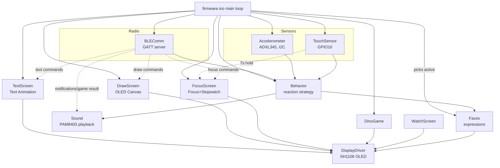

# Pisu Bot

A small ESP32-S3 desk companion robot with an animated face, real sensor
reactions, a Bluetooth-connected Android app, a Windows PC controller app,
a hidden mini-game on the bot itself, a Tic-Tac-Toe game that the bot reacts
to, a **Focus Mode timer**, a **Stopwatch**, a live **Drawing Canvas**, and a **Text Sequence Animation** display. Built by **Roboza**.

This document covers the full architecture, how to build both halves
from source, and how to actually use the finished product — written for
three different readers: a developer picking up the code, someone
building and flashing it, and a support person walking a customer
through it.

---

## Contents

- [What it does](#what-it-does)
- [Hardware](#hardware)
- [Full Wiring Connections](#full-wiring-connections)
- [Repo structure](#repo-structure)
- [Firmware architecture](#firmware-architecture)
- [Firmware module walkthrough](#firmware-module-walkthrough)
- [Bluetooth protocol](#bluetooth-protocol)
- [Building and flashing the firmware](#building-and-flashing-the-firmware)
- [App architecture](#app-architecture)
- [Building the app](#building-the-app)
- [PC Software (Windows Controller)](#pc-software-windows-controller)
- [How to use Pisu Bot](#how-to-use-pisu-bot)
- [Known limitations](#known-limitations)
- [Troubleshooting](#troubleshooting)

---

## What it does

- An animated face on a small OLED display — six expressions (Normal,
  Happy, Sad, Scared, Angry, Dizzy), all built from one shared eye
  shape (not a different icon per mood), with a glint, idle blinking,
  and an idle "look around" so it reads as alive even doing nothing.
- Reacts to being **patted**, **shaken**, or **picked up** — each with
  its own expression and a real recorded sound.
- Goes visibly **Sad** (with a tear) if it's ignored for a while.
- A **hidden Chrome-Dino-style mini-game**, played entirely with the
  touch sensor.
- **Focus Mode** — hold the touch sensor for 7 seconds to instantly start a
  26-minute countdown timer on the OLED display. Also controllable from the
  app with custom timer durations (15 / 26 / 45 / 60 minutes).
- **Stopwatch** — start/pause/reset/exit a live stopwatch via the app,
  shown on the bot's OLED display in real time.
- **Drawing Canvas** — draw on your phone screen or PC canvas and see your artwork appear live on Pisu Bot's OLED display! Includes Draw/Erase modes and full-frame bitmap sync.
- **Text & Text Sequence Animation** — type single custom messages or create an unlimited sequence of text lines (e.g. *Text 1: Hii*, *Text 2: i'm pisu Bot*, *Text 3: How are You Guys ?*). Controls transition speed per text slide!
- Pairs with an **Android app over Bluetooth** — no gesture needed, it's
  advertising the moment it powers on.
- The app can put it into **Watch Mode**, showing time/date/temperature
  sourced from the phone (the bot itself has no internet access or
  clock battery).
- The app **forwards phone notifications** to the bot with an alert sound.
- The app has its own **Tic-Tac-Toe game** — and the bot reacts to
  whether you won or lost, as the opponent it just played.
- A **Windows PC Controller app** (`Pisu_Bot_PC.exe`) — connect via BLE
  or USB Serial, control all features (Watch Face, Draw Canvas, Text Animation, Focus, Games, Notifications) from your desktop.

---

## Hardware

| Part | Notes |
|------|-------|
| ESP32-S3 (or ESP32 with BLE) | See [Known limitations](#known-limitations) re: power |
| 1.3" SH1106 OLED, 128×64, I2C | 4 pins: GND, VCC, SDA, SCL |
| ADXL345 accelerometer | I2C, shares the bus with the display |
| Digital touch sensor (TTP223-style) | Output HIGH while touched |
| PAM8403 mini amplifier + small speaker | GPIO7, bit-banged PCM |
| 3.7V LiPo battery + TP4056 charging module | Optional USB-C power |

---

## Full Wiring Connections

### GPIO Pin Summary

| GPIO | Function | Connected To |
|------|----------|-------------|
| **GPIO 7** | Audio PWM output (bit-banged) | PAM8403 amplifier IN+ |
| **GPIO 8** | I2C SDA (data) | SH1106 OLED + ADXL345 (shared bus) |
| **GPIO 9** | I2C SCL (clock) | SH1106 OLED + ADXL345 (shared bus) |
| **GPIO 10** | Touch sensor digital input | TTP223 SIG/OUT pin |
| **3.3V** | Power rail | OLED VCC, ADXL345 VCC, TTP223 VCC |
| **5V / VIN** | Power rail | PAM8403 VCC, charging module |
| **GND** | Common ground | ALL components |
| *Internal* | Bluetooth BLE antenna | Built into ESP32 — no wiring needed |

---

### 1. OLED Display — SH1106 128×64 (I2C)

| OLED Pin | → | ESP32 Pin | Notes |
|----------|---|-----------|-------|
| VCC | → | **3.3V** | **3.3V only — NOT 5V** |
| GND | → | **GND** | Common ground |
| SDA | → | **GPIO 8** | I2C data |
| SCL | → | **GPIO 9** | I2C clock |

> I2C Address: `0x3C` (default for SH1106). Uses hardware I2C (`Wire` library).

---

### 2. Accelerometer — ADXL345 (I2C, shared bus)

| ADXL345 Pin | → | ESP32 Pin | Notes |
|-------------|---|-----------|-------|
| VCC | → | **3.3V** | **3.3V only** |
| GND | → | **GND** | Common ground |
| SDA | → | **GPIO 8** | Same wire as OLED SDA |
| SCL | → | **GPIO 9** | Same wire as OLED SCL |
| CS | → | **3.3V** | Pull HIGH = forces I2C mode (not SPI) |
| SDO / ALT ADDRESS | → | **GND** | Sets I2C address to `0x53` |
| INT1 | → | *(not connected)* | Optional interrupt — not used |
| INT2 | → | *(not connected)* | Optional interrupt — not used |

> OLED and ADXL345 share the same 2 wires (GPIO 8 & 9). They have different I2C addresses so they coexist fine.

---

### 3. Touch Sensor — TTP223 Breakout

| TTP223 Pin | → | ESP32 Pin | Notes |
|------------|---|-----------|-------|
| VCC | → | **3.3V** | Power |
| GND | → | **GND** | Common ground |
| SIG / OUT | → | **GPIO 10** | HIGH while touched, LOW when released |

> **Touch gesture tiers (from firmware):**
>
> | Hold Duration | Effect |
> |---------------|--------|
> | < 3s, released | **Short tap** → Pat reaction (Happy face + sound) |
> | 3s–8s, released | **Medium hold** → Dino Game open/close |
> | **Hold 7 seconds** | **Focus Mode** → 26-min countdown starts on OLED ⏱️ |
> | Hold 8+ seconds | Long press (reserved for future use) |

---

### 4. Audio Amplifier — PAM8403 + Speaker

| PAM8403 Pin | → | ESP32 / Other | Notes |
|-------------|---|---------------|-------|
| VCC | → | **5V** (or 3.7V LiPo) | Works at 2.5V–5.5V |
| GND | → | **GND** | Common ground |
| IN Left (IN+) | → | **GPIO 7** | Audio signal via bit-banged PWM |
| IN Right | → | **GND** or leave open | Mono only needed |
| OUT Left (+ / -) | → | **Speaker pins** | 8Ω 1W mini speaker |

---

## Repo structure

```
ROBOZAPIUBOT/
├── firmware/           Arduino sketch (ESP32-S3)
│   ├── firmware.ino    Main entry point / loop
│   ├── DrawScreen.h/cpp    Drawing Canvas OLED renderer
│   ├── TextScreen.h/cpp    Custom Text & Text Sequence Animation engine
│   ├── FocusScreen.h/cpp   Focus Mode + Stopwatch display
│   ├── BLEComm.h/cpp   Bluetooth GATT server (8 characteristics)
│   ├── TouchSensor.h/cpp   Touch gestures (short/medium/7s/long)
│   ├── Faces.h/cpp     Animated face expressions
│   ├── Accelerometer.h/cpp ADXL345 shake/pickup/tilt
│   ├── Sound.h/cpp     Bit-banged PCM audio
│   ├── WatchScreen.h/cpp   Clock/date/temp display
│   └── DinoGame.h/cpp  Hidden mini-game
├── app/                Flutter Android app
│   └── lib/
│       ├── screens/    home_screen.dart, draw_screen.dart, text_screen.dart
│       └── services/   ble_service.dart (BLE GATT characteristics client)
├── desktop_app/
│   └── pisu_bot_pc.py  Windows PC controller source (Python/customtkinter)
├── Pisu_Bot.apk        Ready-to-install Android APK
├── Pisu_Bot_PC.exe     Ready-to-run Windows PC controller
└── README.md           This file
```

---

## Firmware architecture



### Screen selection

The main loop picks **one** screen to render on each frame based on active state:

1. **DrawScreen** (if drawing mode active from app/PC)
2. **TextScreen** (if single text or text sequence animation active)
3. **FocusScreen** (if Focus countdown or Stopwatch active)
4. **WatchScreen** (if Watch mode turned on via BLE)
5. **Faces** (default animated face expressions)

---

## Firmware module walkthrough

| File | Role |
|------|------|
| `types.h` | The `Expression` enum (Normal/Happy/Sad/Scared/Dizzy/Angry) |
| `DisplayDriver.h/.cpp` | Owns the shared `display` object, boot splash ("Pisu Bot" / "by Roboza"), status messages |
| `Faces.h/.cpp` | All expressions drawn from one shared eye shape. Mood from size/position/motion/eyelid-tilt cutout |
| `Accelerometer.h/.cpp` | ADXL345 driver — shake detection, pickup detection, tilt |
| `TouchSensor.h/.cpp` | Resolves touch into short/medium/focus(7s)/long(8s) tiers by hold duration |
| `DrawScreen.h/.cpp` | **NEW** — 128x64 bit canvas renderer. Supports pixel, line, clear, and full-frame XBMP chunk loading |
| `TextScreen.h/.cpp` | **NEW** — Custom single text & text sequence slideshow engine with auto word-wrapping & transition timing |
| `FocusScreen.h/.cpp` | Focus Mode countdown timer and Stopwatch drawn to OLED |
| `SoundData.h` | Real recorded sound clips (8-bit PCM at 8kHz) |
| `Sound.h/.cpp` | Plays clips via bit-banged PWM |
| `Behavior.h/.cpp` | Reaction strategy — shake > pickup > pat > idle-Sad priority order |
| `BLEComm.h/.cpp` | BLE GATT server — 8 write-only characteristics |
| `WatchScreen.h/.cpp` | Time/date/temperature display, fed by data from app over BLE |
| `DinoGame.h/.cpp` | Hidden mini-game |
| `firmware.ino` | Entry point — wires everything together |

---

## Bluetooth protocol

One GATT service, **eight** write-only UTF-8 characteristics. Device name: **"Pisu Bot"**.

| Characteristic | UUID suffix | Format / Command Examples | Written by app when |
|----------------|-------------|---------------------------|---------------------|
| `TIME_CHAR` | `...0002` | `"HH:MM\|Weekday, YYYY-MM-DD"` | Every 20s while connected |
| `TEMP_CHAR` | `...0003` | Temperature as text e.g. `"23.5"` | Every 5 minutes |
| `NOTIFY_CHAR` | `...0004` | `"Title\|Message"` | A forwarded phone notification arrives |
| `MODE_CHAR` | `...0005` | `"0"` (Face) or `"1"` (Watch Mode) | User toggles display mode |
| `RESULT_CHAR` | `...0006` | `"win"` / `"lose"` / `"draw"` | Tic-Tac-Toe game ends |
| `FOCUS_CHAR` | `...0007` | `focus:26`, `sw:start`, `sw:stop`, `sw:reset`, `sw:off` | Focus Mode / Stopwatch controls |
| `DRAW_CHAR` | `...0008` | `draw:clear`, `draw:pixel:x,y,s`, `draw:line:x1,y1,x2,y2,s`, `draw:bmp:chunk:hex`, `draw:exit` | Drawing Canvas interactions |
| `TEXT_CHAR` | `...0009` | `text:single:Hii`, `text:seq:2000:Text 1\|Text 2\|Text 3`, `text:exit` | Custom text & Text animation controls |

All UUIDs are under `a1b2c3d4-0001-4000-8000-00805f9b000X`
(`X` = 1 for service, 2–9 for characteristics in order).

---

## PC Software (Windows Controller)

The Windows desktop app `Pisu_Bot_PC.exe` built with `CustomTkinter` matches the mobile Flutter app editorial style:
- **Connection**: BLE scan & connect or USB Serial COM port.
- **WatchFace Hero**: Live desktop clock, date & temperature status.
- **Drawing Canvas**: Interactive 128x64 mouse drawing canvas with Draw/Erase tools, real-time pixel sync, and full bitmap transfer.
- **Text & Animation**: Single custom text entry + infinity Text sequence editor (e.g. *Text 1*, *Text 2*, *Text 3*) with transition slider.
- **Focus & Stopwatch**: Preset Focus timer chips (15/26/45/60m) & Stopwatch controls.
- **Games**: Full interactive Tic-Tac-Toe vs Pisu Bot.
- **Notifications & Reactions**: Desktop alert dispatcher & manual expression trigger matrix.

---

## How to use Pisu Bot

### 1. Basic Interaction
- **Pat on head** → Short tap on top touch sensor → Pisu smiles happily and makes a sound.
- **Shake or jolt** → Pisu gets dizzy, then angry if you keep shaking!
- **Leave idle** → Pisu blinks, looks around, and eventually gets sad with a tear.

### 2. Focus Mode & Stopwatch
- **7-Second Hold**: Press and hold top touch sensor for 7 seconds to start automatic 26-minute Pomodoro timer display.
- **App/PC Focus Control**: Select 15m, 26m, 45m, or 60m focus timer from App or PC Software.
- **Stopwatch**: Start, pause, or reset live stopwatch display from App or PC Software.

### 3. Draw Canvas Mode
- Open **Draw on Pisu Bot** in the App or PC Software.
- Draw or erase with your finger or mouse.
- Watch your drawing appear in real-time or click **Send to Pisu Bot** for full frame update!

### 4. Text & Text Sequence Animation
- Open **Text & Animation** in the App or PC Software.
- Type any single text (e.g. "Hii") to show on screen.
- Or add multiple lines (*Text 1*, *Text 2*, *Text 3...*), set transition speed (e.g. 2.0s), and click **Play Text Animation**!
