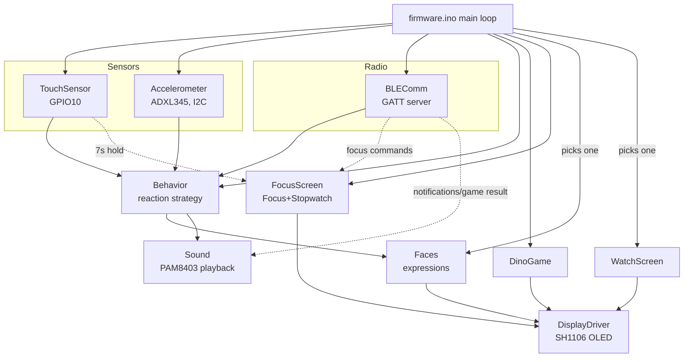
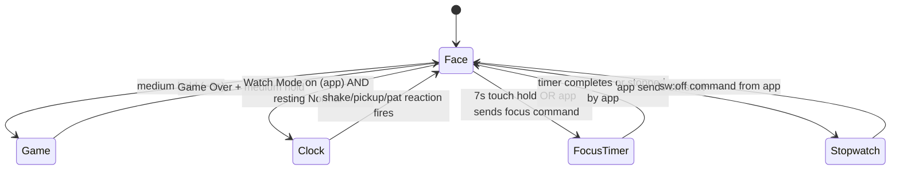

# Pisu Bot

A small ESP32-S3 desk companion robot with an animated face, real sensor
reactions, a Bluetooth-connected Android app, a Windows PC controller app,
a hidden mini-game on the bot itself, a Tic-Tac-Toe game that the bot reacts
to, a **Focus Mode timer**, and a **Stopwatch**. Built by **Roboza**.

This document covers the full architecture, how to build both halves
from source, and how to actually use the finished product — written for
three different readers: a developer picking up the code, someone
building and flashing it, and a support person walking a customer
through it.

---

## Contents

- [What it does](#what-it-does)
- [Hardware](#hardware)
- [Full Wiring Connections](#full-wiring-connections)
- [Repo structure](#repo-structure)
- [Firmware architecture](#firmware-architecture)
- [Firmware module walkthrough](#firmware-module-walkthrough)
- [Bluetooth protocol](#bluetooth-protocol)
- [Building and flashing the firmware](#building-and-flashing-the-firmware)
- [App architecture](#app-architecture)
- [Building the app](#building-the-app)
- [PC Software (Windows Controller)](#pc-software-windows-controller)
- [How to use Pisu Bot](#how-to-use-pisu-bot)
- [Known limitations](#known-limitations)
- [Troubleshooting](#troubleshooting)

---

## What it does

- An animated face on a small OLED display — six expressions (Normal,
  Happy, Sad, Scared, Angry, Dizzy), all built from one shared eye
  shape (not a different icon per mood), with a glint, idle blinking,
  and an idle "look around" so it reads as alive even doing nothing.
- Reacts to being **patted**, **shaken**, or **picked up** — each with
  its own expression and a real recorded sound.
- Goes visibly **Sad** (with a tear) if it's ignored for a while.
- A **hidden Chrome-Dino-style mini-game**, played entirely with the
  touch sensor.
- **Focus Mode** — hold the touch sensor for 7 seconds to instantly start a
  26-minute countdown timer on the OLED display. Also controllable from the
  app with custom timer durations (15 / 26 / 45 / 60 minutes).
- **Stopwatch** — start/pause/reset/exit a live stopwatch via the app,
  shown on the bot's OLED display in real time.
- Pairs with an **Android app over Bluetooth** — no gesture needed, it's
  advertising the moment it powers on.
- The app can put it into **Watch Mode**, showing time/date/temperature
  sourced from the phone (the bot itself has no internet access or
  clock battery).
- The app **forwards phone notifications** to the bot with an alert sound.
- The app has its own **Tic-Tac-Toe game** — and the bot reacts to
  whether you won or lost, as the opponent it just played.
- A **Windows PC Controller app** (`Pisu_Bot_PC.exe`) — connect via BLE
  or USB Serial, control all features from your desktop.

---

## Hardware

| Part | Notes |
|------|-------|
| ESP32-S3 (or ESP32 with BLE) | See [Known limitations](#known-limitations) re: power |
| 1.3" SH1106 OLED, 128×64, I2C | 4 pins: GND, VCC, SDA, SCL |
| ADXL345 accelerometer | I2C, shares the bus with the display |
| Digital touch sensor (TTP223-style) | Output HIGH while touched |
| PAM8403 mini amplifier + small speaker | GPIO7, bit-banged PCM |
| 3.7V LiPo battery + TP4056 charging module | Optional USB-C power |

---

## Full Wiring Connections

### GPIO Pin Summary

| GPIO | Function | Connected To |
|------|----------|-------------|
| **GPIO 7** | Audio PWM output (bit-banged) | PAM8403 amplifier IN+ |
| **GPIO 8** | I2C SDA (data) | SH1106 OLED + ADXL345 (shared bus) |
| **GPIO 9** | I2C SCL (clock) | SH1106 OLED + ADXL345 (shared bus) |
| **GPIO 10** | Touch sensor digital input | TTP223 SIG/OUT pin |
| **3.3V** | Power rail | OLED VCC, ADXL345 VCC, TTP223 VCC |
| **5V / VIN** | Power rail | PAM8403 VCC, charging module |
| **GND** | Common ground | ALL components |
| *Internal* | Bluetooth BLE antenna | Built into ESP32 — no wiring needed |

---

### 1. OLED Display — SH1106 128×64 (I2C)

| OLED Pin | → | ESP32 Pin | Notes |
|----------|---|-----------|-------|
| VCC | → | **3.3V** | **3.3V only — NOT 5V** |
| GND | → | **GND** | Common ground |
| SDA | → | **GPIO 8** | I2C data |
| SCL | → | **GPIO 9** | I2C clock |

> I2C Address: `0x3C` (default for SH1106). Uses hardware I2C (`Wire` library).

---

### 2. Accelerometer — ADXL345 (I2C, shared bus)

| ADXL345 Pin | → | ESP32 Pin | Notes |
|-------------|---|-----------|-------|
| VCC | → | **3.3V** | **3.3V only** |
| GND | → | **GND** | Common ground |
| SDA | → | **GPIO 8** | Same wire as OLED SDA |
| SCL | → | **GPIO 9** | Same wire as OLED SCL |
| CS | → | **3.3V** | Pull HIGH = forces I2C mode (not SPI) |
| SDO / ALT ADDRESS | → | **GND** | Sets I2C address to `0x53` |
| INT1 | → | *(not connected)* | Optional interrupt — not used |
| INT2 | → | *(not connected)* | Optional interrupt — not used |

> OLED and ADXL345 share the same 2 wires (GPIO 8 & 9). They have different I2C addresses so they coexist fine.

---

### 3. Touch Sensor — TTP223 Breakout

| TTP223 Pin | → | ESP32 Pin | Notes |
|------------|---|-----------|-------|
| VCC | → | **3.3V** | Power |
| GND | → | **GND** | Common ground |
| SIG / OUT | → | **GPIO 10** | HIGH while touched, LOW when released |

> **Touch gesture tiers (from firmware):**
>
> | Hold Duration | Effect |
> |---------------|--------|
> | < 3s, released | **Short tap** → Pat reaction (Happy face + sound) |
> | 3s–8s, released | **Medium hold** → Dino Game open/close |
> | **Hold 7 seconds** | **Focus Mode** → 26-min countdown starts on OLED ⏱️ |
> | Hold 8+ seconds | Long press (reserved for future use) |

---

### 4. Audio Amplifier — PAM8403 + Speaker

| PAM8403 Pin | → | ESP32 / Other | Notes |
|-------------|---|---------------|-------|
| VCC | → | **5V** (or 3.7V LiPo) | Works at 2.5V–5.5V |
| GND | → | **GND** | Common ground |
| IN Left (IN+) | → | **GPIO 7** | Audio signal via bit-banged PWM |
| IN Right | → | **GND** or leave open | Mono only needed |
| OUT Left+ | → | **Speaker (+)** | Connect speaker here |
| OUT Left− | → | **Speaker (−)** | Connect speaker here |
| STDBY / MUTE | → | **3.3V** | Pull HIGH to keep amp always enabled |

> **Tip:** Place a **100nF capacitor** between GPIO 7 and PAM8403 IN+ to block DC bias.  
> Sound is 8-bit unsigned PCM at 8000 Hz, bit-banged directly — no LEDC/tone() used.

---

### 5. Power Wiring

| Rail | Source | Supplies |
|------|--------|---------|
| **3.3V** | ESP32 onboard regulator | OLED, ADXL345, TTP223 |
| **5V** | USB-C or LiPo boost converter | PAM8403 VCC |
| **3.7V LiPo** | Battery via TP4056 module | ESP32 VIN |
| **GND** | Common (connect all together) | All components |

---

### Visual Wiring Diagram

```
                    ┌──────────────────────────────────┐
                    │            ESP32-S3               │
                    │                                   │
  [OLED SDA]  ──────│──── GPIO 8   (I2C SDA)            │
  [OLED SCL]  ──────│──── GPIO 9   (I2C SCL)            │
  [ADXL SDA]  ──────┘                                   │  (same wire, shared)
  [ADXL SCL]  ────────────── GPIO 9                     │  (same wire, shared)
                    │                                   │
  [TTP223 OUT]──────│──── GPIO 10  (Touch Input)        │
                    │                                   │
  [PAM8403 IN+]─────│──── GPIO 7   (Audio PWM Out)      │
                    │                                   │
       3.3V ─────── │──── 3V3  ──► OLED, ADXL, TTP223  │
         5V ─────── │──── VIN  ──► PAM8403              │
        GND ─────── │──── GND  ──► All components       │
                    │                                   │
                    │   [BLE built-in — no wiring]      │
                    └──────────────────────────────────┘

  I2C Shared Bus:
  ───────────────
  GPIO 8 (SDA) ──┬──── OLED SDA
                 └──── ADXL345 SDA

  GPIO 9 (SCL) ──┬──── OLED SCL
                 └──── ADXL345 SCL

  Audio Output Chain:
  ────────────────────
  GPIO 7 ──[100nF cap]──► PAM8403 IN+
                           PAM8403 VCC ◄── 5V
                           PAM8403 GND ◄── GND
                           PAM8403 OUT+ ──► Speaker (+)
                           PAM8403 OUT− ──► Speaker (−)
```

> ⚠️ **WARNING:** OLED and ADXL345 are **3.3V ONLY**. Connecting them to 5V will destroy them instantly.  
> ⚠️ **IMPORTANT:** All components must share a **common GND**. A floating ground causes crashes, touch false-triggers, and OLED glitches.  
> 💡 **TIP:** Add 10kΩ pull-up resistors on GPIO 8 (SDA) and GPIO 9 (SCL) to 3.3V if your modules don't have them built in.

---

## Repo structure

```
ROBOZAPIUBOT/
├── firmware/           Arduino sketch (ESP32-S3)
│   ├── firmware.ino    Main entry point / loop
│   ├── FocusScreen.h/cpp   Focus Mode + Stopwatch display
│   ├── BLEComm.h/cpp   Bluetooth GATT server (6 characteristics)
│   ├── TouchSensor.h/cpp   Touch gestures (short/medium/7s/long)
│   ├── Faces.h/cpp     Animated face expressions
│   ├── Accelerometer.h/cpp ADXL345 shake/pickup/tilt
│   ├── Sound.h/cpp     Bit-banged PCM audio
│   ├── WatchScreen.h/cpp   Clock/date/temp display
│   └── DinoGame.h/cpp  Hidden mini-game
├── app/                Flutter Android app
│   └── lib/
│       ├── screens/    home_screen.dart (Focus card + all UI)
│       └── services/   ble_service.dart (BLE + focus commands)
├── desktop_app/
│   └── pisu_bot_pc.py  Windows PC controller source (Python/customtkinter)
├── Pisu_Bot.apk        Ready-to-install Android APK
├── Pisu_Bot_PC.exe     Ready-to-run Windows PC controller
└── README.md           This file
```

---

## Firmware architecture



### Screen selection

The main loop picks **one** thing to draw each frame:



Watch Mode only shows the Clock screen while nothing reactive is
happening — a shake, a pickup, a pat, or a Tic-Tac-Toe result all still
pop the animated Face up over the clock, then it settles back on its
own once the reaction ends.

### Touch gestures

| Gesture | Effect |
|---------|--------|
| Short tap-and-release (< 3s) | **Pat**: Happy face + sound for ~3.5s, then back to Normal |
| Medium hold (3–8s), released | Opens/closes the **Dino game** |
| Instant tap (touch-down) | **Jump** while playing the Dino game |
| **Hold exactly 7 seconds** | **Focus Mode** — 26-minute countdown starts immediately on OLED |
| Hold ≥ 8s | Reserved / long press (not currently wired) |

---

## Firmware module walkthrough

| File | Role |
|------|------|
| `types.h` | The `Expression` enum (Normal/Happy/Sad/Scared/Dizzy/Angry) |
| `DisplayDriver.h/.cpp` | Owns the shared `display` object, boot splash ("Pisu Bot" / "by Roboza"), status messages |
| `Faces.h/.cpp` | All expressions drawn from one shared rounded-rectangle eye shape. Mood from size/position/motion/eyelid-tilt cutout. Also: idle glint dot, Dizzy's orbiting dot, Sad's falling tear, idle "look around" |
| `Accelerometer.h/.cpp` | ADXL345 driver — shake detection (magnitude jolt), pickup detection (sustained cosine-similarity deviation from calibrated resting orientation), tilt (feeds idle eye-tracking) |
| `TouchSensor.h/.cpp` | Resolves touch into short/medium/focus(7s)/long(8s) tiers by hold duration |
| `FocusScreen.h/.cpp` | **NEW** — Focus Mode countdown timer and Stopwatch, drawn to OLED. Controlled by touch (7s hold) or BLE commands |
| `SoundData.h` | Real recorded sound clips (Happy/Sad/Scared/Angry/Alarm), 8-bit PCM at 8kHz, embedded as PROGMEM arrays |
| `Sound.h/.cpp` | Plays clips via bit-banged PWM (avoids `tone()`/LEDC APIs — see file header) |
| `Behavior.h/.cpp` | Reaction strategy — shake > pickup > pat > idle-Sad priority order |
| `BLEComm.h/.cpp` | BLE GATT server — see [Bluetooth protocol](#bluetooth-protocol) |
| `WatchScreen.h/.cpp` | Time/date/temperature display, fed by data from app over BLE |
| `DinoGame.h/.cpp` | Hidden mini-game — forgiving inset hitboxes, slow difficulty ramp (~45s to top speed) |
| `firmware.ino` | Entry point — wires everything together |

---

## Bluetooth protocol

One GATT service, **six** write-only UTF-8 characteristics. Device name: **"Pisu Bot"**.

| Characteristic | UUID suffix | Format | Written by app when |
|----------------|-------------|--------|---------------------|
| `TIME_CHAR` | `...0002` | `"HH:MM\|Weekday, YYYY-MM-DD"` | Every 20s while connected |
| `TEMP_CHAR` | `...0003` | Temperature as text e.g. `"23.5"` | Every 5 minutes |
| `NOTIFY_CHAR` | `...0004` | `"Title\|Message"` | A forwarded phone notification arrives |
| `MODE_CHAR` | `...0005` | `"0"` (Face) or `"1"` (Watch Mode) | User toggles display mode |
| `RESULT_CHAR` | `...0006` | `"win"` / `"lose"` / `"draw"` | Tic-Tac-Toe game ends |
| `FOCUS_CHAR` | `...0007` | See below | Focus Mode / Stopwatch commands |

**Focus characteristic command strings:**

| Command | Effect on bot |
|---------|---------------|
| `focus:26` | Start 26-minute Focus Mode countdown on OLED |
| `focus:15` | Start 15-minute Focus Mode countdown |
| `focus:45` | Start 45-minute Focus Mode countdown |
| `focus:60` | Start 60-minute Focus Mode countdown |
| `focus:0` | Stop Focus Mode, return to normal face |
| `sw:start` | Start Stopwatch on OLED |
| `sw:stop` | Pause Stopwatch |
| `sw:reset` | Reset Stopwatch to 00:00.0 |
| `sw:off` | Exit Stopwatch, return to normal face |

All UUIDs are under `a1b2c3d4-0001-4000-8000-00805f9b000X`
(`X` = 1 for service, 2–7 for characteristics above in order).

---

## Building and flashing the firmware

1. Install the **Arduino IDE**, then Espressif's **ESP32 board package**
   (Boards Manager → search "esp32").
2. Install via Library Manager: **U8g2** (display driver).
   Everything else (`Wire`, `BLEDevice`/`BLEServer`/`BLEUtils`) ships
   with the ESP32 core.
3. Open `firmware/firmware.ino`.
4. Tools → Board → pick your ESP32-S3 variant. Tools → Port → your board's port.
5. Upload.
6. Open Serial Monitor at **115200 baud** to watch boot logs, BLE events,
   and accelerometer calibration output.

If you hit `text section exceeds available space`, go to Tools →
Partition Scheme and pick "Huge APP" — this firmware has been trimmed to
fit the default scheme, but there's very little headroom left.

---

## App architecture

Flutter, Android only. Key files under `app/lib/`:

| File | Role |
|------|------|
| `main.dart` | App theme (warm-paper editorial palette) and entry point |
| `screens/home_screen.dart` | Main screen — clock hero, Connection card, Watch Mode toggle, **Focus Mode & Stopwatch card**, Game card, Notifications card |
| `screens/tic_tac_toe_screen.dart` | Tic-Tac-Toe game |
| `services/ble_service.dart` | GATT client — scanning, connecting, all `sendX()` writes including **focus commands** |
| `services/notification_forwarder.dart` | Wraps Android's `NotificationListenerService` |
| `services/notification_prefs.dart` | Per-app notification filtering (`SharedPreferences`) |
| `services/weather_service.dart` | Temperature via phone location + open-meteo.com (no API key) |

`flutter_blue_plus` is pinned to the `1.x` line — `2.x` introduced a
commercial licensing requirement that doesn't belong here.

---

## Building the app

1. Install **Flutter SDK** (stable channel, Dart `^3.13.3`) and Android Studio.
2. `cd app`
3. `flutter pub get`
4. Plug in an Android phone with USB debugging enabled.
5. `flutter run` for debug, or:
   - `flutter build apk --release` for the release APK.
6. Install: `adb install -r build/app/outputs/flutter-apk/app-release.apk`

A pre-built APK (`Pisu_Bot.apk`) is included in this repo — ready to sideload.

---

## PC Software (Windows Controller)

`desktop_app/pisu_bot_pc.py` — a full-featured Windows desktop app that
mirrors the mobile app's UI and capabilities.

**Requirements:**
```
pip install customtkinter pillow bleak pyserial
```

**Run from source:**
```
python desktop_app/pisu_bot_pc.py
```

**Or use the pre-built EXE** — `Pisu_Bot_PC.exe` (included in repo root, no Python needed).

**Features:**
- Live clock hero card (time + date)
- **Connect via Bluetooth BLE** (scans for "Pisu Bot") or **USB Serial** (115200 baud)
- Bot Display Mode toggle (Simple Face / Watch Mode)
- **Focus Mode** — timer presets (15m / 26m / 45m / 60m), start/stop
- **Stopwatch** — start, pause, reset, exit
- Tic-Tac-Toe game with live bot reactions
- Custom desktop notification sender
- Reaction tester panel

**Build EXE from source:**
```
pip install pyinstaller
pyinstaller --onefile --windowed --name "Pisu_Bot_PC" desktop_app/pisu_bot_pc.py
```

---

## How to use Pisu Bot

### First-time setup

1. Power the bot on — it starts advertising BLE immediately.
2. Install `Pisu_Bot.apk` on Android, or open `Pisu_Bot_PC.exe` on Windows.
3. Tap **Connect BLE** — no pairing gesture needed on the bot side.
4. Done — the app immediately syncs time and temperature.

### The face

- Sitting idle, it looks around on its own every few seconds — intentional, not a glitch.
- **Pat it** (quick touch < 3s): goes Happy for a few seconds.
- **Shake it**: goes Dizzy → Angry if kept shaking → Happy once it stops.
- **Pick it up**: goes Scared until set back down.
- **Ignore it for a few minutes**: goes Sad (with a tear) — pat it to cheer it up.

### Focus Mode ⏱️

**Two ways to start Focus Mode:**

1. **On the bot directly** — hold the touch sensor for **7 seconds**. The OLED immediately shows a 26-minute countdown: `FOCUS MODE` / `26:00` / `Stay Focused!`
2. **From the app or PC software** — open the Focus Mode card, choose a duration (15 / 26 / 45 / 60 min), tap **Start Focus Timer**. The bot's OLED shows the countdown live.

When the timer reaches 00:00, the bot plays a happy sound and returns to its normal face.

### Stopwatch

Open the **Focus Mode & Stopwatch** card in the app or PC software:
- **Start** — begins counting up on the bot's OLED: `STOPWATCH` / `00:00.0` / `[ Running ]`
- **Pause** — freezes the timer on screen: `[ Paused ]`
- **Reset** — resets to 00:00.0
- **Exit** — removes stopwatch from bot display, returns to normal face

### The hidden game

Hold the touch sensor for about 3 seconds to open it. Tap to jump over
the cacti. When you crash, hold ~3 seconds again to go back.

### Watch Mode

In the app, switch **Bot Display Mode** to **Watch Mode**. The bot now
shows time, date, and temperature from your phone. Patting, shaking,
or picking it up still works — it pops to the face to react, then returns
to the clock on its own.

### Notifications

Open the Notifications card → tap **Grant notification access** → once
granted, every phone notification gets forwarded to the bot with an alert
sound. Tap **Choose which apps** to filter specific apps.

### Playing Tic-Tac-Toe

Open the **Game** card. You're X, Pisu Bot is O. When a game ends:
- **You win** → bot goes Sad.
- **You lose** → bot goes Happy.
- **Draw** → no bot reaction.

---

## Known limitations

- **Sound playback is fully blocking.** Every sound occupies the main loop
  for its full duration (up to ~3.75s) — touch input, shake detection, and
  BLE processing are all paused during that window. A shake or pat that
  happens mid-sound can be missed.
- **No BLE bonding/pairing security.** Anyone in Bluetooth range can
  connect to the bot — no PIN or bonding step.
- **Sleepy is unused.** The expression exists in `Faces.cpp`/`types.h`
  but nothing triggers it currently.
- **ESP32 power sensitivity.** On thin USB supplies, radio activity can
  cause brownout resets. Use a solid 5V/1A+ supply.
- **No iOS app** — Android only. Windows PC app is available.

---

## Troubleshooting

**The bot resets in a loop right after boot.** Check the power supply
first (brownout note above) before assuming a firmware bug.

**The app says "Bot not found."** Confirm the bot is powered on. It
advertises continuously from boot — there's no pairing-mode window to miss.

**Focus Mode doesn't start from 7s hold.** Make sure you're holding the
touch sensor continuously for the full 7 seconds without releasing. The
firmware fires the event exactly at the 7-second mark.

**The app shows connected but nothing updates.** Check that `BLEComm.h`
UUIDs still match `ble_service.dart` exactly — if either side's protocol
changes, the other needs updating too.

**Sketch too big to compile.** Switch Partition Scheme to "Huge APP"
in Arduino IDE Tools menu.

**A shake/pat doesn't register.** If it happened right after another sound
started playing, that's the blocking-audio limitation — wait for the
current sound to finish.

**PC app can't find the bot via BLE.** Make sure your PC has Bluetooth
enabled and you have the `bleak` library installed. Try USB Serial
connection as an alternative — connect the bot via USB and select the
correct COM port.
