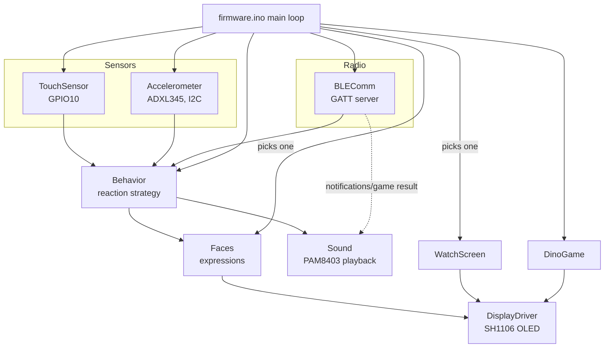
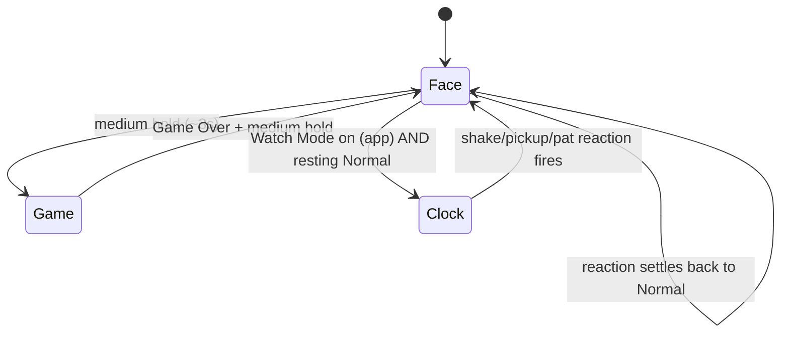

# Pisu Bot

A small ESP32-C3 desk companion robot with an animated face, real sensor
reactions, a Bluetooth-connected Android app, a hidden mini-game on the
bot itself, and a Tic-Tac-Toe game in the app that the bot actually
reacts to. Built by **Roboza**.

This document covers the full architecture, how to build both halves
from source, and how to actually use the finished product — written for
three different readers: a developer picking up the code, someone
building and flashing it, and a support person walking a customer
through it.

---

## Contents

- [What it does](#what-it-does)
- [Hardware](#hardware)
- [Repo structure](#repo-structure)
- [Firmware architecture](#firmware-architecture)
- [Firmware module walkthrough](#firmware-module-walkthrough)
- [Bluetooth protocol](#bluetooth-protocol)
- [Building and flashing the firmware](#building-and-flashing-the-firmware)
- [App architecture](#app-architecture)
- [Building the app](#building-the-app)
- [How to use Pisu Bot](#how-to-use-zani) (end-user guide)
- [Known limitations](#known-limitations)
- [Troubleshooting](#troubleshooting)

---

## What it does

- An animated face on a small OLED display — six expressions (Normal,
  Happy, Sad, Scared, Angry, Dizzy), all built from one shared eye
  shape (not a different icon per mood), with a glint, idle blinking,
  and an idle "look around" so it reads as alive even doing nothing.
- Reacts to being **patted**, **shaken**, or **picked up** — each with
  its own expression and a real recorded sound.
- Goes visibly **Sad** (with a tear) if it's ignored for a while.
- A **hidden Chrome-Dino-style mini-game**, played entirely with the
  touch sensor.
- Pairs with an **Android app over Bluetooth** — no gesture needed, it's
  advertising the moment it powers on.
- The app can put it into **Watch Mode**, showing time/date/temperature
  sourced from the phone (the bot itself has no internet access or
  clock battery).
- The app **forwards phone notifications** to the bot with an alert
  sound.
- The app has its own **Tic-Tac-Toe game** — and the bot reacts to
  whether you won or lost, as the opponent it just played.

## Hardware

| Part | Notes |
|---|---|
| ESP32-C3 (this project used a "SuperMini"-style board) | See [Known limitations](#known-limitations) re: power |
| 1.3" SH1106 OLED, 128×64, I2C | 4 pins: GND, VCC, SDA, SCL |
| ADXL345 accelerometer | I2C, shares the bus with the display |
| Digital touch sensor (TTP223-style) | Output HIGH while touched |
| PAM8403 mini amplifier + small speaker | |

### Wiring

| Signal | ESP32-C3 pin |
|---|---|
| I2C SDA (display + accelerometer) | GPIO8 |
| I2C SCL (display + accelerometer) | GPIO9 |
| Touch sensor output | GPIO10 |
| Speaker amp input | GPIO7 |

Both the display and the accelerometer share the same I2C bus (SDA/SCL)
— that's normal, they have different I2C addresses.

## Repo structure

```
ROBOZAPIUBOT/
├── firmware/     Arduino sketch (ESP32-C3) — see below
├── app/          Flutter Android app — see below
└── README.md     This file
```

## Firmware architecture



### Screen selection

The main loop picks **one** thing to draw each frame:



Watch Mode only shows the Clock screen while nothing reactive is
happening — a shake, a pickup, a pat, or a Tic-Tac-Toe result all still
pop the animated Face up over the clock, then it settles back on its
own once the reaction ends. The Dino game is a separate top-level mode
that takes over the screen exclusively; Bluetooth/Watch Mode/reactions
are all paused while playing it.

### Touch gestures

| Gesture | Effect |
|---|---|
| Short tap-and-release (< 3s) | **Pat**: Happy face + sound for ~3.5s, then back to Normal. Counts as interaction (resets the idle-to-Sad timer). |
| Medium hold (~3-8s), released | Opens the Dino game (from normal mode) / exits it (once Game Over is showing) |
| Instant tap (touch-down) | Jump, while playing the Dino game |
| Hold ≥ 8s | Reserved — not currently wired to anything (kept for a future gesture; see `TouchSensor.h`) |

## Firmware module walkthrough

| File | Role |
|---|---|
| `types.h` | The `Expression` enum (Normal/Happy/Sad/Scared/Dizzy/Angry/Sleepy — Sleepy is reserved, not currently triggered by anything) |
| `DisplayDriver.h/.cpp` | Owns the shared `display` object, the boot splash ("Pisu Bot" / "by Roboza"), and one-line/two-line status messages |
| `Faces.h/.cpp` | Every expression, drawn from one shared rounded-rectangle eye shape. Mood comes from size/position/motion/an optional eyelid-tilt cutout — not a different icon per mood. Also: the idle glint dot, Dizzy's orbiting dot, Sad's falling tear, and the autonomous idle "look around" |
| `Accelerometer.h/.cpp` | ADXL345 driver — shake detection (magnitude jolt), pickup detection (sustained cosine-similarity deviation from a self-calibrated resting orientation), and tilt (feeds the idle eye-tracking effect) |
| `TouchSensor.h/.cpp` | Resolves a touch into short/medium/long tiers by how long it was held |
| `SoundData.h` | Real recorded sound clips (Happy/Sad/Scared/Angry/Alarm), 8-bit PCM at 8kHz, embedded as PROGMEM arrays |
| `Sound.h/.cpp` | Plays those clips via bit-banged PWM (deliberately not the ESP32 `tone()`/LEDC APIs — see the file's own header comment) |
| `Behavior.h/.cpp` | The reaction strategy — see [Touch gestures](#touch-gestures) and the file's own header comment for the exact priority order (shake > pickup > pat > idle-Sad) |
| `BLEComm.h/.cpp` | The BLE GATT server — see [Bluetooth protocol](#bluetooth-protocol) |
| `WatchScreen.h/.cpp` | The time/date/temperature display, fed entirely by data the app sent over BLE |
| `DinoGame.h/.cpp` | The hidden mini-game — tuned to be forgiving (inset hitboxes), a slow difficulty ramp (~45s to top speed), and a "Tap to jump!" hint for first-time players |
| `firmware.ino` | Entry point — wires everything above together; see [Screen selection](#screen-selection) |

## Bluetooth protocol

One GATT service, five write-only UTF-8 characteristics (the phone
writes to the bot; nothing is read back). Device name: **"Pisu Bot"**.

| Characteristic | Format | Written by the app when |
|---|---|---|
| `TIME_CHAR` | `"HH:MM\|Weekday, YYYY-MM-DD"`, 24-hour | Every 20s while connected, and on connect |
| `TEMP_CHAR` | Temperature as text, e.g. `"23.5"` | Every 5 minutes, from the phone's location + open-meteo.com (no API key) |
| `NOTIFY_CHAR` | `"Title\|Message"` | A forwarded phone notification arrives (plays the alarm sound on the bot) |
| `MODE_CHAR` | `"0"` (Face) or `"1"` (Watch Mode) | The user toggles the mode in the app |
| `RESULT_CHAR` | `"win"` / `"lose"` / `"draw"`, from the **phone user's** perspective | A Tic-Tac-Toe game ends. The bot reacts as the *opponent*: user win → bot Sad; user loss → bot Happy; a draw gets no reaction. |

All UUIDs live under `a1b2c3d4-0001-4000-8000-00805f9b000X` (`X` = 1
for the service, 2-6 for the characteristics above, in the order
listed). See `BLEComm.h`'s header comment for the exact strings.

## Building and flashing the firmware

1. Install the **Arduino IDE**, then Espressif's **ESP32 board package**
   (Boards Manager → search "esp32").
2. Install these libraries via Library Manager: **U8g2** (display).
   Everything else (`Wire`, `BLEDevice`/`BLEServer`/`BLEUtils`) ships
   with the ESP32 core.
3. Open `firmware/firmware.ino`.
4. Tools → Board → pick your exact ESP32-C3 board/variant. Tools → Port
   → your board's port.
5. Upload.
6. Open the Serial Monitor at 115200 baud to watch boot logs, BLE
   connect/disconnect events, and accelerometer calibration output.

If you hit `text section exceeds available space`, check Tools →
Partition Scheme and pick one with a larger app partition (e.g. "Huge
APP") — this firmware has been trimmed to fit the default scheme, but
there's very little headroom left for adding much more without doing
that.

## App architecture

Flutter, Android only (no iOS project in this repo). Key files under
`app/lib/`:

| File | Role |
|---|---|
| `main.dart` | App theme (an editorial, warm-paper palette rather than a dark "tech" look) and entry point |
| `screens/home_screen.dart` | The main screen — live clock/temperature hero, Connection card, Watch Mode toggle, Game card, Notifications card |
| `screens/notification_apps_screen.dart` | Per-app notification filtering (defaults to forwarding everything) |
| `screens/tic_tac_toe_screen.dart` | The Tic-Tac-Toe game — see [Playing Tic-Tac-Toe](#playing-tic-tac-toe) |
| `services/ble_service.dart` | Talks to the bot's GATT server — scanning, connecting, and every `sendX()` write. UUIDs here must match `BLEComm.h` exactly |
| `services/notification_forwarder.dart` | Wraps Android's `NotificationListenerService`; forwards to the bot over BLE |
| `services/notification_prefs.dart` | Persists which apps are forwarded (`SharedPreferences`) |
| `services/weather_service.dart` | Current temperature via the phone's location + open-meteo.com, no API key |

`flutter_blue_plus` is deliberately pinned to the `1.x` line (see the
comment in `pubspec.yaml`) — `2.x` introduced a commercial licensing
requirement (a required license parameter, a build-time "license ping")
that doesn't belong in a product being sold without buying that
license. `1.x` is plain BSD-3-Clause.

## Building the app

1. Install the **Flutter SDK** (stable channel; this project targets
   Dart `^3.13.3`, i.e. a reasonably recent Flutter release) and
   Android Studio (or just its command-line SDK tools) for the Android
   toolchain.
2. `cd app`
3. `flutter pub get`
4. Plug in an Android phone with USB debugging enabled, or start an
   emulator (BLE won't work in most emulators — use a real phone for
   anything Bluetooth-related).
5. `flutter run` for a debug build straight to the device, or:
   - `flutter build apk --debug` for a quick sideloadable APK, or
   - `flutter build apk --release` for a real release build.
6. Install it: `adb install -r build/app/outputs/flutter-apk/app-<debug|release>.apk`

`flutter analyze` should report no issues; that's checked before every
release.

### Publishing a release

Releases are published as downloadable APKs on the repo's GitHub
Releases page, so anyone can install it without building from source:

```bash
cd app
flutter build apk --release
gh release create vX.Y.Z "build/app/outputs/flutter-apk/app-release.apk" \
  --title "Pisu Bot App vX.Y.Z" --notes "What changed in this version"
```

## How to use Pisu Bot

### First-time setup

1. Power the bot on.
2. Install the app on an Android phone (see [Building the app](#building-the-app),
   or download the latest release APK from this repo's Releases page)
   and open it.
3. Tap **Connect** on the Connection card — the bot is already
   advertising, no gesture needed on its side.
4. That's it. The app immediately starts syncing time and temperature.

### The face

- Sitting idle, it looks around on its own every few seconds — that's
  intentional, not a glitch.
- **Pat it** (a quick touch): it goes Happy for a few seconds.
- **Shake it**: it goes Dizzy for a moment, then Angry if you keep
  shaking, then Happy once you stop.
- **Pick it up**: it goes Scared until you set it back down.
- **Ignore it for a few minutes**: it goes Sad (with a tear) — pat it to
  cheer it up.

### The hidden game

Hold the touch sensor for about 3 seconds to open it. Tap to jump over
the cacti. When you crash, tap once to retry, or hold ~3 seconds again
to go back to the normal face.

### Watch Mode

In the app, switch **Bot Display Mode** to **Watch Mode**. The bot now
shows time, date, and temperature instead of the animated face — sourced
from your phone, since the bot has no internet or clock battery of its
own. Patting, shaking, or picking it up still works exactly the same;
it pops back to the animated face to react, then returns to the clock
on its own.

### Notifications

The first time you open the Notifications card, tap **Grant
notification access** — this opens Android's system settings, since
Android doesn't allow requesting this as a normal permission dialog.
Once granted, every notification your phone receives gets forwarded to
the bot with an alert sound, by default. Tap **Choose which apps** to
narrow that down to specific apps instead of everything.

### Playing Tic-Tac-Toe

Open the **Game** card and tap **Play**. You're X, Pisu Bot is O. The AI is
deliberately beatable (about 60% of the time it plays well — winning or
blocking when it can, otherwise picking randomly) so games are genuinely
winnable, not just a formality. When a game ends:
- **You win** → the bot goes Sad (it lost).
- **You lose** → the bot goes Happy (it won).
- **A draw** → no reaction from the bot; there's no natural "how do you
  feel about a tie" response.

This only reaches the bot while the app is connected to it over
Bluetooth.

## Known limitations

- **Sound playback is fully blocking.** Every sound plays via a
  bit-banged PWM loop that occupies the whole main loop for its
  duration (up to ~3.75s for the longest clip, Scared) — touch input,
  shake detection, and BLE processing are all unresponsive during that
  window. This is a deliberate simplicity tradeoff (see `Sound.h`'s own
  header comment on why `tone()`/LEDC were avoided) rather than an
  oversight, but it's worth knowing about: a shake or pat that happens
  in the middle of another sound playing can be missed. Fixing this
  properly would mean moving audio playback onto a hardware
  timer/interrupt instead of blocking the main loop — a real
  architecture change, not attempted here.
- **No BLE bonding/pairing security.** Anyone in Bluetooth range can
  connect to the bot; there's no PIN or bonding step. Acceptable for a
  desk toy, not for anything sensitive.
- **Sleepy is unused.** The expression and eye-shape parameters exist
  in `Faces.cpp`/`types.h`, but nothing currently triggers it — it was
  reserved for a possible future "very long idle" state, sleepier than
  Sad.
- **This exact ESP32-C3 board variant ("SuperMini"-style) has shown
  genuine power-related brownout resets** when a radio (WiFi, when an
  earlier version of this firmware used it) draws a power spike on a
  weak/thin USB supply. The current firmware doesn't use WiFi, so this
  isn't currently a live issue, but it's worth knowing if that ever
  gets revisited: use a solid 5V/1A+ power source, not a thin
  data-only cable.
- **No iOS app** — Android only.

## Troubleshooting

**The bot resets in a loop right after boot.** Check the power supply
first (see the brownout note above) before assuming it's a firmware
bug.

**The app says "Bot not found."** Confirm the bot is actually powered
on. It advertises continuously from boot, so there's no pairing-mode
window to miss.

**The app shows connected but nothing updates.** Check `BLEComm.h`'s
UUIDs still match `ble_service.dart`'s exactly — if either side's
protocol changes, the other needs updating too (they're independent
files with no shared source of truth other than this README and each
other's comments).

**Sketch too big to compile.** See
[Building and flashing the firmware](#building-and-flashing-the-firmware)
above — switch Partition Scheme before trying to trim more code; there
isn't much dead weight left to cut.

**A shake/pat doesn't seem to register.** If it happened right after
another sound started playing, that's the blocking-audio limitation
above, not a bug — wait for the current sound to finish.
